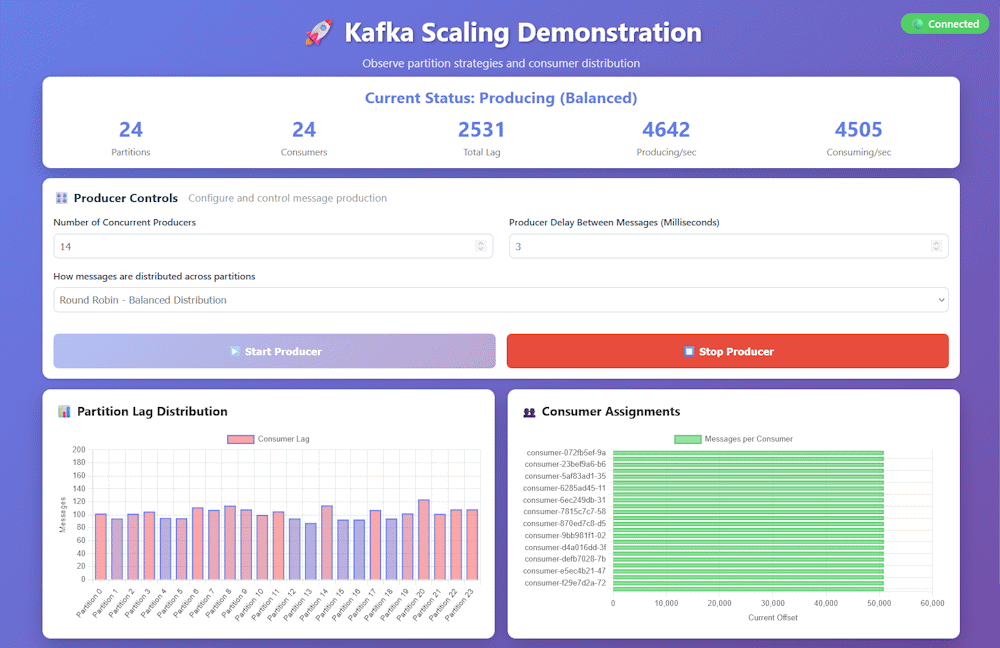

# Kafka Scaling Demonstration

A hands-on demonstration showing Kafka's scaling techniques and pitfalls through observable stages.



## To Run:
Change to the directory you placed the code, then run docker compose:
- **cd kafka-scaling-demo**
- **docker compose up -d**
- **docker compose down -v** - when finished

After startup view the dashboard @ http://localhost:3000

Also includes standard kafka monitor @ http://localhost:8080

## Configure From Docker Compose file
To change settings, stop the containers (**docker compose down -v**) then edit these settings in docker-compose.yml:

### Producer
- **NUMBER_OF_PARTITIONS**: How many partitions to use for the topic, defaults to 6

### Consumer
- **MILLISECONDS_SIMULATED_WORK**: This is how many milliseconds the consumer waits before getting another message, defaults to 5
- **replicas**: How many consumers to deploy, ideally at least as many as partitions, defaults to 6

## How It Works:

- Click Start Producer Button → Dashboard calls producer/api/produce-messages
- Producer generates messages into the topic
- Consumers read messages → Simulate doing work
- Dashboard server monitors metrics → Polls Kafka every 300 ms
- Dashboard server Streams to UI → Via WebSocket, charts update in real-time

## Prerequisites

- Docker & Docker Compose
- Java 21+ (for local development)
- Maven (for local development)

### Test Scenarios To Try:
What's your high score? Try some of the suggestions in Kafka-Performance-Tuning.md

```bash
# Scenario 1: High producer rate
producerCount: 14
msBetweenMessages: 3
partitionStrategy: ROUND_ROBIN
partitions:24
replicas: 12

# Scenario 2: Sustained load
producerCount: 1
msBetweenMessages: 1
partitionStrategy: ROUND_ROBIN

# Scenario 3: Hot partition problem
producerCount: 2
msBetweenMessages: 1
partitionStrategy: HOT_PARTITION
```
